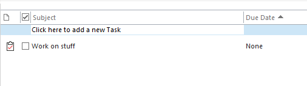
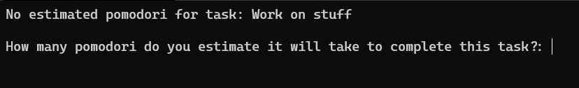
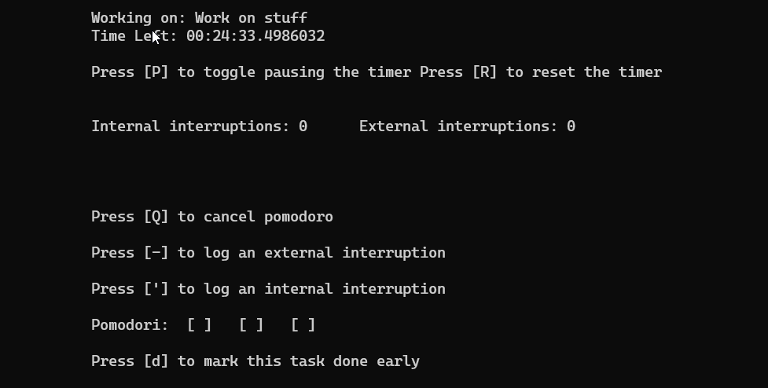
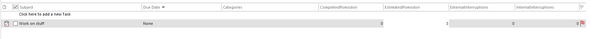

# OutlookPomodoro

## Introduction

This is a personal productivity tool I developed to help myself stay on track of tasks. It requires that you be using a Windows computer with Outlook installed.

Original inspiration was from https://github.com/janegilring/PSProductivityTools and [The Pomodoro Technique](https://en.wikipedia.org/wiki/Pomodoro_Technique)

## Features

* Work is tracked in Outlook which means
  * Work is synced across machines
  * Work and work history is easily reportable via Excel/PowerBI
  * Emails can quickly be turned into [work items](https://support.microsoft.com/en-us/office/create-a-task-from-a-message-40deff88-941a-4fc0-aba1-7d929d947795)
* An optional 'ding' every configurable number of minutes to give your brain a hit of dopamine for staying on task
* Track interruptions (internal/external) and automatically follow-up on them at the end of each work interval (you will be prompted to forget them or add an Outlook note for later).
* Track estimated vs actual pomodori to complete a task (this can be used to generate a personal velocity metric, if you're into the solo Scrum methodology)

## Installation

This module is not currently set up on the PowerShell Gallery. You will need to [install it manually](https://docs.microsoft.com/en-us/powershell/scripting/developer/module/installing-a-powershell-module?view=powershell-7.1).

## Requirements

* PowerShell 5 or later
* Microsoft Outlook

## Usage

1. Add a task in Outlook



2. Start Working on your tasks

```pwsh
# Get some tasks from Outlook
[array]$Tasks = Get-OutlookTasks -Folder "[MyEmailAddress]\Tasks\" -State Open

# Start working on them
do {
   Start-PomodoroWork -Task $Tasks[0] -Minutes 25 -DingMinutes 1
   [array]$Tasks = Get-OutlookTasks -Folder "[MyEmailAddress]\Tasks\" -State Open
} while ($Tasks.count -gt 0)
```

3. You will be prompted to estimate how many pomodori it will take to complete the task



4. Work on the task!



5. Keep track of work in Outlook

The module will add new custom columns to the task object in Outlook for tracking your estimates/interruptions/etc.

You can view these within Outlook by:

  a) Right click on the columns Outlook

  b) Select **Columns...**

  c) Select in the drop-down menu **User-defined fields in folder**

  d) Add the following fields: **CompletedPomodori, EstimatedPomodori, ExternalInterruptions, InternalInterruptions**.

Your tasks should now look like this in Outlook:



If you don't want to estimate pomodori in PowerShell you can now use this view to provide estimates and Outlook will no longer prompt you.
